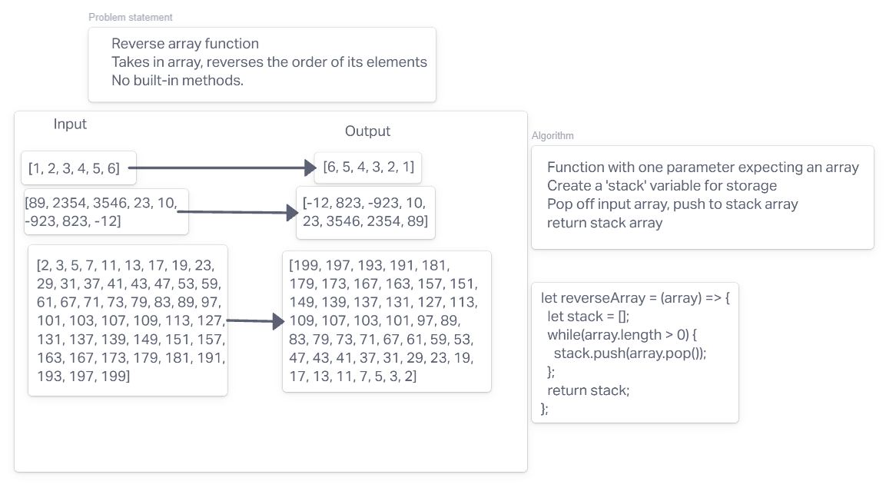

# Reverse an Array
<!-- Description of the challenge -->
Given an array, return an array with the elements in a reversed order.

## Whiteboard Process

## Approach & Efficiency
<!-- What approach did you take? Discuss Why. What is the Big O space/time for this approach? -->
The approach I took was to begin with how to remove the end of a given array, and how to place it into the beginning of another, via a stack.
