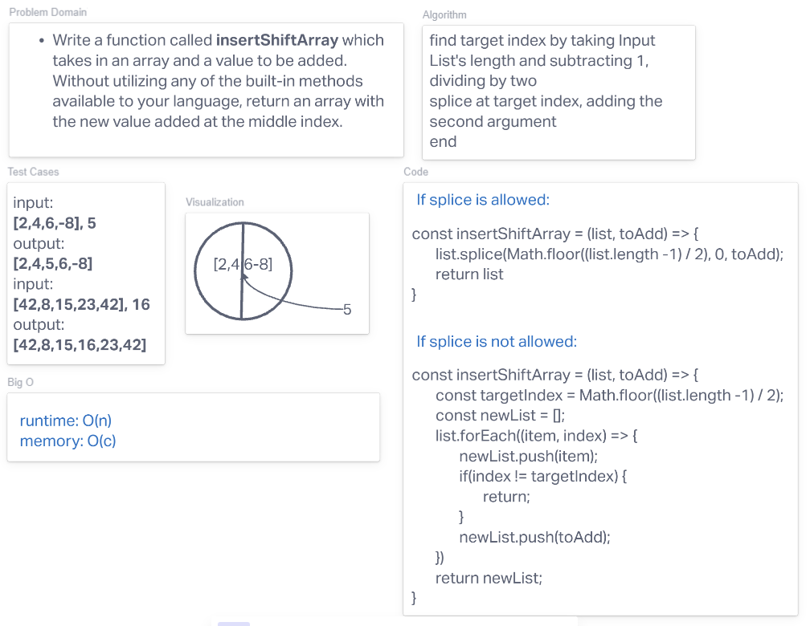

# Insert into array
<!-- Description of the challenge -->
Given an array, return an array with the elements in a reversed order.

## Whiteboard Process

## Approach & Efficiency
<!-- What approach did you take? Discuss Why. What is the Big O space/time for this approach? -->
Hugo and I took the approach of targetting the middle of an array, and calling splice to insert the new element. Then, in the case that splice is not allowed, we instead loop through the array checking for the target index, and when we're at the target index we also insert the new element.
