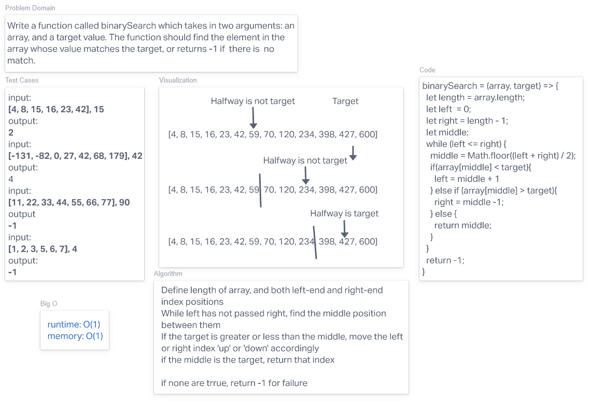

# Binary searching
<!-- Description of the challenge -->
Write a function called binarySearch which takes in two arguments: an array, and a target value. The function should find the element in the array whose value matches the target, or returns -1 if there is  no match.

## Whiteboard Process

## Approach & Efficiency
<!-- What approach did you take? Discuss Why. What is the Big O space/time for this approach? -->
[Wikipedia](https://en.wikipedia.org/wiki/Binary_search_algorithm)

At the start of this, I was only vaguely familiar with the concept of a binary search due to previous exploration into sorting algorithms for fun. This helped me understand what was going on with the binary search algorithm as I read about it, and helped me break down what their more raw code is doing. I took time to parse through the steps of what it is expected to do and translated that into how I would write the algorithm in JavaScript.
