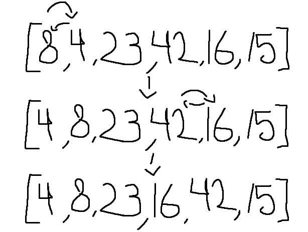

# Algorithm / Explanation

This function iterates over the array and makes a check between the previous value and the current and swaps them if the previous is greater so that it pushes greater values toward the end of the array. This will step the 'great' value along through the array until it reaches a value that is no longer lesser. The function iterates over the entire array over and over until it no longer has swaps to do, which means the array is now sorted from least to greatest.

### big O

Time: O(n^2)
Space: O(1)

## Visuals

## Testing
