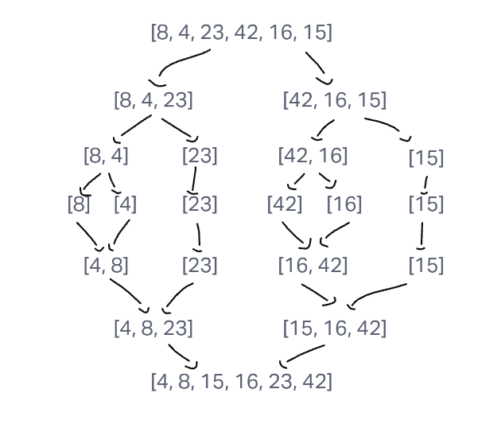

# Algorithm / Explanation

mergeSort recursively divides the starting array into two halves over and over until the arrays it creates are no longer divisible (singular elements). Then, each iteration of the merge function that is called after every split sorts the sub-arrays back together in the sorted order until every sub-array has been merged back into one single sorted array, which is then returned as the end solution.

### big O

Time: O(nlogn)
It must iterate over the array, and the smaller sub-arrays which are half as large as their parent
Space: O(n)
It creates a sub-array for every element

## Visuals

## Testing
