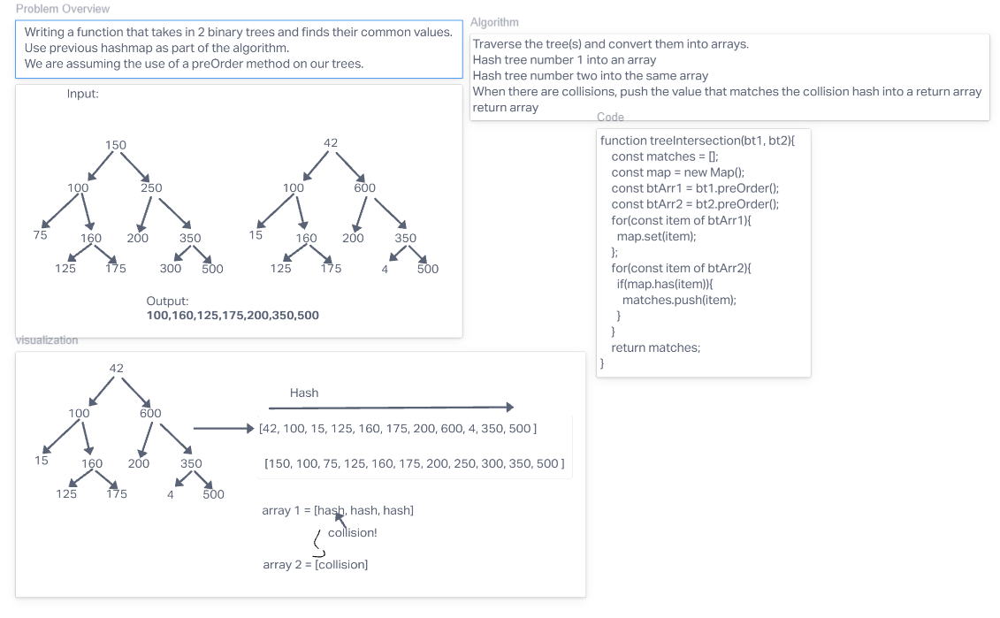

# Algorithm / Explanation

treeIntersection traverses the trees and converts them into arrays, then maps the first tree. It then checks if the map already contains values as it traverses the second tree. When there is a collision of matching values, it pushes those into a return array as our end result.

### big O

Time: O(n)
Space: O(n)

## Visuals

## Testing

npm test to check if treeIntersection correctly returns the shared values