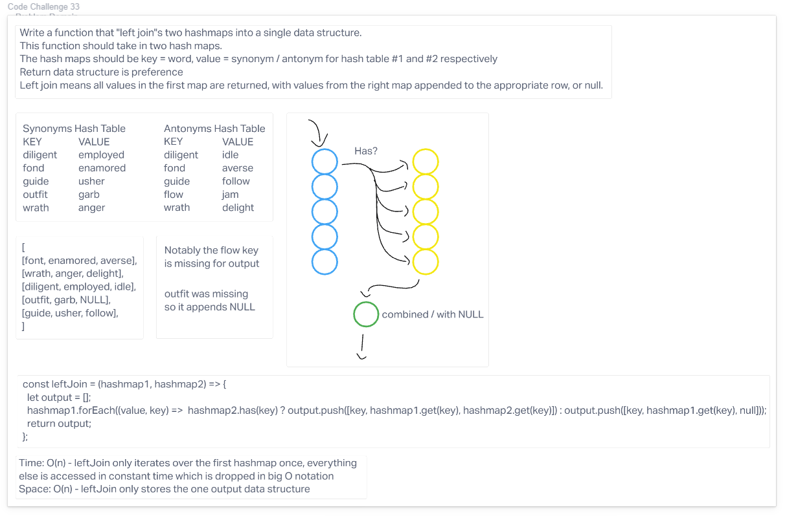

# Algorithm / Explanation

leftJoin takes in two hashmaps and performs a left join, returning a new dataset. The new dataset contains the first hashmap, and appended values from the second hashmap or null if there is no matching key.

## big O

Time: O(n) - leftJoin only iterates over the first hashmap once, everything else is accessed in constant time which is dropped in big O notation
Space: O(n) - leftJoin only stores the one output data structure

## Visuals

## Testing

npm i
&&
npm test to check if leftJoin correctly returns the new data structure
